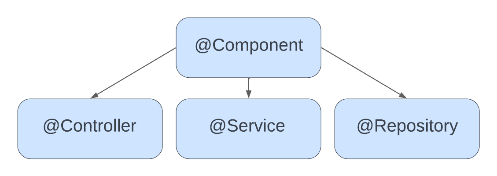

# Spring Certified Professional 2023 - Study Guide

## Module 1 - Container, Dependency, and IOC

***

### 1. What is dependency injection and what are the advantages?
Dependency injection is a technique of creating software in which objects 
do not create their own dependencies. Instead, objects declare dependencies that they need
and it is the external objects job, or framework, to provide concrete dependencies to the object.

Types of Dependency Injection:
- Constructor injection
- Setter injection
- Interface injection

Advantages of using Dependency Injection:
- Increases code re-usability  
- Increases code readability 
- Increases code maintainability 
- Increases code testability
- Reduces coupling
- Increases cohesion 

#### Example

Without dependency injection - tightly coupled
- It cannot be used and tested independently from this class (hard-dependency)
```
public class Chef {

    private Food burger;
    
    public Chef() {
        burger = new Burger();
    }
    
    public void cook() {
        // code...
    }
}
```
With dependency injection - loosely coupled
- We decoupled the construction of the main class from the construction of it's dependencies
- The dependency is provided from the outside
- If the objects implementation changes in the future,  it is no longer the dependent classes responsibility to figure out what actually changed
```
public class Chef {

    private Food food;
    
    public Chef(Food food) {
        this.food = food;
    }
    
    public void cook() {
        // code...
    }
}
```

***

### 2. What is a pattern? What is an anti-pattern? Is dependency injection a pattern?

A Software Design Pattern is a reusable solution to often, commonly occurring problem in software design. It is a high level description on how to solve the problem that can be used in many different situations. Design patterns often represent best practices that developers can use to solve common problems.

Commonly used design patterns: 

- Builder
- Factory Method
- Template Method
- Visitor
- Facade
- Composite
- Strategy 
- Observer

An anti-pattern is an ineffective and counter-productive solution to an often occurring problem.

Examples of anti-patterns in OOP:

- God Object
- Circular dependency 
- Constant interface 
- Sequential coupling

Dependency injection is a pattern that solves the problem of flexible dependency creation.

***

### 3. What is an interface and what are the advantages of making use of them in Java? Why are they recommended for Spring Beans?

**OOP Definition** 

An interface is a description of the actions an object can perform. It is a way to enforce actions on objects that implement the interface.

**Java Definition** 

An Interface in Java programming language is defined as an abstract type used to specify the behavior of a class. An interface in Java is a blueprint of a behaviour. A Java interface contains static constants and abstract methods.

The interface in Java is a mechanism to achieve abstraction. There can be only abstract methods in the Java interface, not the method body. It is used to achieve abstraction and multiple inheritance in Java. In other words, you can say that interfaces can have abstract methods and variables. It cannot have a method body. Java Interface also represents the IS-A relationship.

When we decide a type of entity by its behaviour and not via attribute we should define it as an interface.

Like a class, an interface can have methods and variables, but the methods declared in an interface are by default abstract (only method signature, no body).

A Java interface may also contain:

- Constants 
- Default methods (Java 8)
- Static methods
- Nested types

#### Advantages of using interfaces in Java 

- Allows decoupling between the contract and it's implementation 
- Allows declaring contract between callee and caller
- Increases interchangeability 
- Increases testability 

#### Advantages of using interfaces in Spring

- Allows for use of JDK Dynamic proxy 
- Allows implementation hiding 
- Allows to easily switch beans

<br />

<p align="center">Vehicle Interface</p>

~~~
interface Vehicle {
     
    // all are the abstract methods.
    void changeGear(int a);
    void speedUp(int a);
    void applyBrakes(int a);
}
~~~

<p align="center">Vehicle Bicycle Class</p>

```
class Bicycle implements Vehicle{
     
    int speed;
    int gear;
     
    // to change gear
    @Override
    public void changeGear(int newGear){
         
        gear = newGear;
    }
     
    // to increase speed
    @Override
    public void speedUp(int increment){
         
        speed = speed + increment;
    }
     
    // to decrease speed
    @Override
    public void applyBrakes(int decrement){
         
        speed = speed - decrement;
    }
     
    public void printStates() {
        System.out.println("speed: " + speed
            + " gear: " + gear);
    }
}
```

_Source: https://www.geeksforgeeks.org/interfaces-in-java/_
***

### 4. What is meant by "application-context"?

The Application Context is a central part of a Spring Application. It holds bean definitions and contains registry and application components. It allows you to retrieve assembled and configured beans.

**Main responsibilities of Application Context:** 

- Initiates, configures, and assembles beans
- Manages bean lifecycle
- Is a Bean Factory
- Is a Resource Loader
- Has the ability to push events to registered event listeners 
- Exposes environment which allows to resolve properties

**Common Application Context types:**

- AnnotationConfigApplicationContext
- AnnotationConfigWebApplicationContext
- ClassPathXmlApplicationContext
- FileSystemXmlApplicationContext
- XmlWebApplicationContext


***

### 5. What is the concept of a "container" and what is its lifecycle?

The Spring container is the core of Spring Framework. The container is used for creating the objects and configuring them. Also, Spring IoC Containers use for managing the complete lifecycle from creation to its destruction. It uses Dependency Injection (DI) to manage components and these objects are called Spring Beans. The container uses configuration metadata which represent by Java code, annotations or XML along with Java POJO classes

**Spring Container Lifecycle**

- Application is started
- Spring container is created
- Container reads configuration
- Bean definitions are created from configuration
- BeanFactoryPostProcessors are processing bean definitions
- Instances of Spring Beans are created
- Spring Beans are configured and assembled - resolve property values and inject
- BeanPostProcessors are called
- Application runs
- Application gets shut down
- Spring context is closed
- Destruction callbacks are invoked

***

### 6. How are you going to create a new instance of an ApplicationContext?

Non-Web Application:

- AnnotationConfigApplicationContext
- ClassPathXmlApplicationContext
- FileSystemXmlApplicationContext 

Web Applications:

- Servlet 2 - web.xml, ContextLoaderListener, DispatchServlet
- Servlet 3 - XmlWebApplicationContext
- Servlet 3 - AnnotationConfigWebApplicationContext

Spring Boot:

- SpringBootConsoleApplication - CommandLineRunner
- SpringBootApplication - Embedded Tomcat


***

### 7. Can you describe the lifecycle of a Spring Bean in an ApplicationContext?

**Context is created**

- Bean definitions are created based on Spring Bean Configuration
- BeanFactoryPostProcessors are invoked

**Bean is created**

- Instance of Bean is created
- Properties and Dependencies are set
- BeanPostProcessor::postProcessBeforeInitialization is called
- @PostConstruct method gets called
- InitializingBean::afterPropertiesSet method gets called
- @Bean(initMethod) gets called
- BeanPostProcessor::postProcessAfterInitialization gets called

Bean is ready to use

**Bean is destroyed**

- @PreDestroy method gets called
- DisposableBean::destroy gets called 
- @Bean(destroyMethod) method gets called 


***

### 8. How are you going to create an ApplicationContext in an Integration test? 

Add Spring test dependency:
```
<dependency>
    <groupId>org.springframework</groupId>
    <artifactId>spring-test</artifactId>
    <version>5.1.6.RELEASE</version>
    <scope>test</scope>
</dependency>
```

Add Spring Runner to the test class:
```
@RunWith(SpringRunner.class)
public class ServiceTest {
    // ...
}
```

Add Context Configuration to the test class
```
@RunWith(SpringRunner.class)
@ContextConfiguration(classes = AppConfig.class) 
public class ServiceTest {
    // ...
}
```

***

### 9. What is the preferred way to close an Application Context? Does Spring do this for you?

Standalone non-web applications:

- Register shutdown hook by calling ConfigurableApplicationContext#registerShutdownHook - recommended way
- ConfigurableApplicationContext#close

Web Application:

- ContextLoaderListener will automatically close context when the web containers stops the web application

Spring Boot:

- Application Context will automatically be closed 
- Shutdown hook will automatically be registered 
- ContextLoaderListener applies to Spring Boot Web Application as well 

***

### 10. Can you describe: Dependency Injection using Java configuration? DI using annotations (@Component, @Autowired)? Component scanning, Stereotypes and MetaAnnotations? Scopes for Spring Beans? What is the default scope?

**Dependency Injection using Java configuration**

When using DI with Java configuration, you need to explicitly define all of your beans and use @_Bean_ (to define the bean) and @_Autowire_ (to inject any dependencies) at the method level.

Example:

```
@Configuration
public class AppConfiguration {

    @Bean
    @Autowired
    public class bean1(Bean2 bean2, Bean3 bean3){
        return new Bean1(bean2, bean3);
    }
    
    @Bean
    public class bean2(){
        return new Bean2();
    }
    
    @Bean
    public class bean3(){
        return new Bean3();
    }
}
```
<br> 

**Dependency Injection using Annotations**

Create classes annotated with the @Component annotation:

```
@Component
public class SpringBeanOne {}
```
```
@Component
public class SpringBeanTwo {}
```
```
@Component
public class SpringBeanThree {}
```
<br> 
Define dependencies when required:

```
@Component
public class SpringBeanOne {

    @Autowired
    public SpringBeanTwo springBeanTwo
    
    @Autowired
    public SpringBeanThree springBeanThree
}
```
<br>

Create configuration with Component Scanning enabled:

```
@ComponentScan
public class ApplicationConfiguration {}
```
<br> 

**Component Scanning**

Component Scanning is the process in which Spring scans the Classpath in search for classes annotated with stereotype annotations  (@Component, @Service, @Controller...) and based on those create bean definitions.

Simple Component Scanning within Configuration package and all subclasses:
```
@ComponentScan
public class ApplicationConfiguration {
}
```

Advanced Component Scanning rules:
```
@ComponentScan(
        basePackages = "com.spring.professional.exam.tutorial.module01.question10.annotations.beans",
        //basePackageClasses = SpringBean1.class,
        includeFilters = @ComponentScan.Filter(type = FilterType.REGEX, pattern = ".*Bean.*"),
        excludeFilters = @ComponentScan.Filter(type = FilterType.REGEX, pattern = ".*Bean1.*")
)
public class ApplicationConfigurationAdvanced {
}
```

<br> 

**Stereotypes - Definition**

Stereotypes are annotations applied to classes to describe the role that will be performed by this class. Spring discovers classes by stereotypes and creates definitions based on those types.



Types of Stereotypes:

- Component - generic component in the system, root stereotype, candidate for autoscanning
- Service - class will contain business logic
- Repository - class is a data repository used for data access objects and persistence
- Controller - class is a controller, usually a web controller (used with @RequestMapping)

_Source: https://www.udemy.com/course/spring-certified-tutorial/_

<br> 

**Meta-annotations**

Meta-annotations are annotations that can be used to create new annotations.

Example:

@RestController annotation is using @Controller
```
@Target(ElementType.TYPE)
@Retention(RetentionPolicy.RUNTIME)
@Documented
@Controller
@ResponseBody
public @interface RestController {

@AliasFor(annotation = Controller.class)
String value() default "";

}
```

<br> 

**Scopes of Spring Beans**

| Scope      | Description                                |
|------------|--------------------------------------------|
| Singleton  | Single Bean per Spring Container (Default) |
| Prototype  | New instance each time a Bean is requested |
| Request    | New instance per each HTTP Request         |
| Session    | New instance per each HTTP Session         |
| Application | One instance per each ServletContext       |
| Websocket  | One instance per each WebSocket            |


***

### 19. What is a proxy object and what are the two different types of proxy objects Spring can create? What are the limitations of these two types of proxies? What is the power of a proxy object and what are the disadvantages? 

A proxy object is an object that adds additional logic on top of the object that is being proxied without having to modify the code of the proxied object. The proxy object has the same public methods as the object that is being proxied, and it should be as much as possible indistinguishable from the proxies object. When a method is involked on the Proxy Object, additional code, usually before and after sections are involked, also code from the proxies object is invoked by the Proxy Object. 

The Spring Framework supports two kinds of proxies:

- JDK Dynamic Proxy - used by default if target object implements interface
- CGLIB Proxy - used when target does not implement any interface

Limitations of JDK Proxy:
- Requires proxy object to implement the interface
- Only interface methods will be proxied 
- No support for self-invocation

Limitations of CBLIB Proxy:
- Does not work for final classes or final methods 
- No support for self-invocation 

Proxy Advantages:

- Ability to change behaviour of existing beans without changing original code
- Separation of concerns (loggin, transactions, security...)

Proxy Disadvantages:

- May create code hard to debug
- Needs to use unchecked exception for exceptions not declared in original method
- May cause performance issues if before/after section in proxy code us using IO
- May cause unexpected equals operator results since Proxy Object and Proxied Object are two different objects

