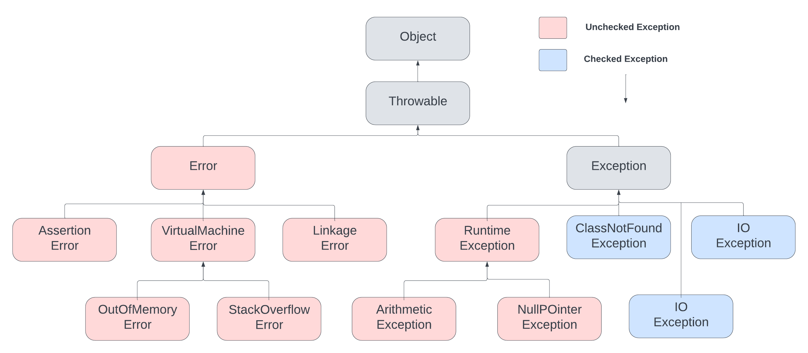

# Spring Certified Professional 2023 - Study Guide

## Module 3 - Data Management: JDBC, Transactions, Spring Data JPA

***

<br>

## 1. What is the difference between checked and unchecked exceptions?

#### Checked Exceptions

In general, checked exceptions represent errors outside the control of the program. For example, the constructor of FileInputStream throws FileNotFoundException if the input file does not exist.

**Java verifies checked exceptions at compile-time.**

Therefore, we should use the throws keyword to declare a checked exception:

```java
private static void checkedExceptionWithThrows() throws FileNotFoundException {
    File file = new File("not_existing_file.txt");
    FileInputStream stream = new FileInputStream(file);
}
```
We can also use a try-catch block to handle a checked exception:


```java
private static void checkedExceptionWithThrows() throws FileNotFoundException {
    File file = new File("not_existing_file.txt");
    FileInputStream stream = new FileInputStream(file);
}
```
Some common checked exceptions in Java are IOException, SQLException and ParseException.

The Exception class is the superclass of checked exceptions, so we can create a custom checked exception by extending Exception:

```java
public class IncorrectFileNameException extends Exception {
    public IncorrectFileNameException(String errorMessage) {
        super(errorMessage);
    }
}
```

#### Unchecked Exceptions

If a program throws an unchecked exception, it reflects some error inside the program logic.

For example, if we divide a number by 0, Java will throw ArithmeticException:

**Java does not verify unchecked exceptions at compile-time.** Furthermore, we don't have to declare unchecked exceptions in a method with the throws keyword. And although the above code does not have any errors during compile-time, it will throw ArithmeticException at runtime.

Some common unchecked exceptions in Java are NullPointerException, ArrayIndexOutOfBoundsException and IllegalArgumentException.

The RuntimeException class is the superclass of all unchecked exceptions, so we can create a custom unchecked exception by extending RuntimeException:

```java
public class NullOrEmptyException extends RuntimeException {
    public NullOrEmptyException(String errorMessage) {
        super(errorMessage);
    }
}
```
_Reference: https://www.baeldung.com/java-checked-unchecked-exceptions_

#### Why does Spring prefer unchecked exception?

- Reduces cluttered code
- Reduces coupling between callee and caller
- Give you more freedom - do you want to handle the exception or not, how to handle it etc.

<p align="center">The hierarchy of Exceptions in the Java</p>




#### What is the data access exception hierarchy?

Object -> Throwable -> Exception -> RuntimeException -> NestedRuntimeException  -> DataAccessException

This exception hierarchy aims to let user code find and handle the kind of error encountered without knowing the details of the particular data access API in use (e.g. JDBC). Thus, it is possible to react to an optimistic locking failure without knowing that JDBC is being used.

As this class is a runtime exception, there is no need for user code to catch it or subclasses if any error is to be considered fatal (the usual case).

_Source: https://docs.spring.io/spring-framework/docs/current/javadoc-api/org/springframework/dao/DataAccessException.html_

***

## 2. How do you configure a DataSource in Spring? Which bean is very useful for development/test databases?

Configuration of Data Source in Spring is dependent on the type of application that is executed.

#### Standalone

Data Source is configured in @Configuration class and is created as a bean of one of the supported data source types.

~~~java
@Configuration
public class DataSourceConfig

    @Bean
    public DataSource dataSource
        BasicDataSource basicDataSource = new BasicDataSource();
        basicDataSource.setDriverClassName("org.hsqldb.jdbcDriver");
        basicDataSource.setUrl("jdbc:hsqldb:mem:locahost");
        return basicDataSource;
~~~

#### Spring Boot

Data Source is configured through _application.properties_

```
spring.datasource.url=jdbc:hsqldb:mem:locahost
spring.datasource.driver-class-name=org.hsqldb.jdbcDriver
```

#### Application Server

Data Source should be fetched from JNDI via JndiDataSourceLookup / JndiTemplate. Application Server is responsible for creating and managing the data source requested in resources configurations of deployment descriptors. 

#### Which bean is very useful for development/test databases?

When working with development/test databases, the following beans are very useful:

- EmbeddedDatabaseBuilder - Allows you to easily configure H2/HSQLDB embedded database with schema/data initialization scripts
- DataSourceInitializer / ResourceDatabasePopulator - Allows you to use schema/data initialization scripts without usage of _EmbeddedDatabaseBuilder_

<br>

***

## 3. What is the Template design pattern and what is the JDBC template?

The Template Design Pattern is a behavioural design pattern that can be used to
encapsulate an algorithm/main flow with its stepsin a way to achieve steps customization and shared code re-usability. It is achieved 
by creating an abstract class that contains the algorithm definition/main flow with shared code, and the child classes extending the abstract class can customize the steps of the algorithm.

Template Design Pattern suggests that:

1. Break down the algorithm into a series of methods
2. Put a series of calls to these methods or steps inside a single @template method"
3. The steps may either be abstract, or have some defaults implementation inside the parent class
4. To use the algorithm, the client must provide its own subclass and implement all abstract steps

_Video: https://www.youtube.com/watch?v=cGoVDzHvD4A&ab_channel=Geekific_

**<p align="center">Template Method Abstract Class</p>**

~~~java
public abstract class HouseTemplate {

	// Template method, final so subclasses can't override
	public final void buildHouse(){
		buildFoundation();
		buildPillars();
		buildWalls();
		buildWindows();
		System.out.println("House is built.");
	}

	// Default implementation - Chose to override or not
	private void buildWindows() {
		System.out.println("Building Glass Windows");
	}

	private void buildFoundation() {
		System.out.println("Building foundation with cement,iron rods and sand");
	}
	
	// Methods to be implemented by subclasses
	public abstract void buildWalls();
	public abstract void buildPillars();
}
~~~ 

**<p align="center">Template Method Concrete Class</p>**

~~~java
public class WoodenHouse extends HouseTemplate {

	@Override
	public void buildWalls() {
		System.out.println("Building Wooden Walls");
	}

	@Override
	public void buildPillars() {
		System.out.println("Building Pillars with Wood coating");
	}

}
~~~

_Source: https://www.digitalocean.com/community/tutorials/template-method-design-pattern-in-java_

#### What is the JDBC Template?

Spring JdbcTemplate is a powerful mechanism to connect to the database and execute SQL queries. It internally uses JDBC api, but eliminates a lot of problems of JDBC API.

Problems of JDBC API

- We need to write a lot of code before and after executing the query, such as creating connection, statement, closing resultset, connection etc.
- We need to perform exception handling code on the database logic.
- We need to handle transaction.
- Repetition of all these codes from one to another database logic is a time consuming task.

Advantage of Spring JdbcTemplate
- Spring JdbcTemplate eliminates all the above mentioned problems of JDBC API. It provides you methods to write the queries directly, so it saves a lot of work and time.

~~~java
import org.springframework.jdbc.core.JdbcTemplate;  
  
public class EmployeeDao {  

    private JdbcTemplate jdbcTemplate;  
      
    public void setJdbcTemplate(JdbcTemplate jdbcTemplate) {  
        this.jdbcTemplate = jdbcTemplate;  
    }  
      
    public int saveEmployee(Employee e){  
        String query="insert into employee values(  
        '"+e.getId()+"','"+e.getName()+"','"+e.getSalary()+"')";  
        return jdbcTemplate.update(query);  
    }  
    
    public int updateEmployee(Employee e){  
        String query="update employee set   
        name='"+e.getName()+"',salary='"+e.getSalary()+"' where id='"+e.getId()+"' ";  
        return jdbcTemplate.update(query);  
    }  
    
    public int deleteEmployee(Employee e){  
        String query="delete from employee where id='"+e.getId()+"' ";  
        return jdbcTemplate.update(query);  
    }  
    
    public List<Employee> getEmloyees(){  
      String SQL = "select * from Employee";
      List <Employee> employee = jdbcTemplateObject.query(SQL, new EmployeeMapper());
      return students; 
    }  
}
~~~

_Source: https://www.javatpoint.com/spring-JdbcTemplate-tutorial_


<br>

***

## 4. What is a callback? What are the three JdbcTemplate callback interfaces that can be used with queries? What is each used for?

_(You would not have to remember the interface names in the exam, but you should know what they do if you see them in a code sample)._

In Java, a callback is a mechanism that allows a piece of code to be executed at a later time in response to a specific event or condition.

A callback function or method is a reference to executable code that is passed as an argument to another function or method. The function that receives the callback can then call the callback function at the appropriate time, passing any necessary data as arguments.

**On Java level callback can be:**
- Class that implements interface
- Anonymous class
- Lambda expression – JDK 8
- Reference Method – JDK 8

### Jdbc Template Callbacks that can be used with queries:

**RowMapper**

In the JDBC template of Spring Framework, `RowMapper` is an interface that defines a strategy for mapping a row of a `ResultSet` to an object.

When we execute a query using JDBC template, we get a `ResultSet` that contains the results of the query. We need to map this `ResultSet` to a collection of objects that can be used in our application. The `RowMapper` interface provides a way to map each row of the `ResultSet` to an object.

The `RowMapper` interface has one method: `mapRow()`. This method takes two arguments: the `ResultSet` object and the row number. It returns the mapped object.

For example, let's say we have a database table called employees with columns id, name, and age. We can use a `RowMapper` to map each row of the `ResultSet` to an `Employee` object:

```java
public class EmployeeRowMapper implements RowMapper<Employee> {

    @Override
    public Employee mapRow(ResultSet rs, int rowNum) throws SQLException {
        Employee employee = new Employee();
        employee.setId(rs.getInt("id"));
        employee.setName(rs.getString("name"));
        employee.setAge(rs.getInt("age"));
        return employee;
    }
}
```

In this example, we've created a **RowMapper** implementation called `EmployeeRowMapper` that maps each row of the `ResultSet` to an `Employee` object. We use the `ResultSet` to get the values of each column for the current row, and then create a new `Employee` object with those values.

We can then use this `RowMapper` to execute a query and map the results to a list of `Employee` objects:

```java
List<Employee> employees = jdbcTemplate.query(
        "SELECT id, name, age FROM employees",
        new EmployeeRowMapper());

```
In this example, we're using the `query()` method of `JdbcTemplate` to execute a query and map the results to a list of `Employee` objects using the `EmployeeRowMapper`. The `query()` method executes the SQL query and returns the results as a list of `Employee` objects.

<br>

**RowCallbackHandler**

In JDBC template of Spring Framework, `RowCallbackHandler` is an interface that allows us to process each row of a `ResultSet` object individually, without the need to map the entire result set to a collection of objects.

When we execute a query using JDBC template, we can use a `RowCallbackHandler` to process each row of the `ResultSet` one at a time. This can be useful when we want to perform some operation on each row individually, such as printing the values or updating some other data based on the values.

The `RowCallbackHandler` interface has one method: `processRow()`. This method takes two arguments: the `ResultSet` object and the row number.

For example, let's say we have a database table called employees with columns `id`, `name`, and `age`. We can use a `RowCallbackHandler` to print the values of each row:

```java
public class EmployeeRowCallbackHandler implements RowCallbackHandler {

    @Override
    public void processRow(ResultSet rs) throws SQLException {
        int id = rs.getInt("id");
        String name = rs.getString("name");
        int age = rs.getInt("age");
        System.out.println("Employee: id=" + id + ", name=" + name + ", age=" + age);
    }
}
```

In this example, we've created a `RowCallbackHandler` implementation called `EmployeeRowCallbackHandler` that prints the values of each row of the `ResultSet`. We use the `ResultSet` to get the values of each column for the current row and then print them.

We can then use this `RowCallbackHandler` to execute a query and process the results:

```java
jdbcTemplate.query("SELECT id, name, age FROM employees", new EmployeeRowCallbackHandler());
```

In this example, we're using the `query()` method of `JdbcTemplate` to execute a query and process the results using the `EmployeeRowCallbackHandler`. The `query()` method executes the SQL query and calls the `processRow()` method of the `EmployeeRowCallbackHandler` for each row in the `ResultSet`.

<br>

**ResultSetExtractor**

In JDBC template of Spring Framework, `ResultSetExtractor` is an interface that allows us to extract data from a ResultSet object and convert it into an object of our choice.

When we execute a query using JDBC template, we can use a `ResultSetExtractor` to extract data from the `ResultSet` and map it to an object of our choice. This can be useful when we want to map the entire result set to a single object or a collection of objects.

The `ResultSetExtractor` interface has one method: `extractData()`. This method takes a `ResultSet` object as an argument and returns an object of our choice.

For example, let's say we have a database table called `employees` with columns `id`, `name`, and `age`. We can use a `ResultSetExtractor` to map the entire result set to a collection of `Employee` objects:

```java
public class EmployeeResultSetExtractor implements ResultSetExtractor<List<Employee>> {

    @Override
    public List<Employee> extractData(ResultSet rs) throws SQLException {
        List<Employee> employees = new ArrayList<>();
        while (rs.next()) {
            Employee employee = new Employee();
            employee.setId(rs.getInt("id"));
            employee.setName(rs.getString("name"));
            employee.setAge(rs.getInt("age"));
            employees.add(employee);
        }
        return employees;
    }
}
```

In this example, we've created a `ResultSetExtractor` implementation called `EmployeeResultSetExtractor` that maps the entire result set to a List of `Employee` objects. We use the `ResultSet` to iterate over each row of the result set, create a new `Employee` object for each row, and set its properties with the values from the `ResultSet`.

We can then use this `ResultSetExtractor` to execute a query and map the results to a List of `Employee` objects:

```java
List<Employee> employees = jdbcTemplate.query("SELECT id, name, age FROM employees", new EmployeeResultSetExtractor());
```

In this example, we're using the `query()` method of `JdbcTemplate` to execute a query and map the results to a `List` of `Employee` objects using the `EmployeeResultSetExtractor`. The `query()` method executes the SQL query, calls the `extractData()` method of the `EmployeeResultSetExtractor` to extract the data from the `ResultSet`, and returns the result as a `List` of `Employee` objects.

<br>

***

## 5. Can you execute a plain SQL statement with the JDBC template?


Yes, the JDBC template of Spring Framework provides methods to execute plain SQL statements.

The `execute()` method of `JdbcTemplate` is used to execute any SQL statement and it returns a `Boolean` value indicating whether the statement was successfully executed or not.

Here's an example of how to use the `execute()` method to execute a plain SQL statement:

```java
jdbcTemplate.execute("CREATE TABLE employees (id INT PRIMARY KEY, name VARCHAR(50), age INT)");
```

In this example, we're using the `execute()` method of `JdbcTemplate` to create a new table named employees with three columns: `id`, `name`, and `age`. The `execute()` method executes the SQL statement and returns a `Boolean` value indicating whether the statement was successfully executed or not.

We can also use the `update()` method of `JdbcTemplate` to execute plain SQL statements that update the database. The `update()` method returns the number of rows affected by the statement.

Here's an example of how to use the `update()` method to update data in a table:

```java
jdbcTemplate.update("UPDATE employees SET age = 30 WHERE name = 'John'");
```
In this example, we're using the `update()` method of `JdbcTemplate` to update the age column of the employees table for all rows where the name column equals 'John'. The `update()` method executes the SQL statement and returns the number of rows affected by the statement.

<br>

***

## 6. When does the JDBC template acquire (and release) a connection, for every method called or once per template? Why?

The JDBC template of Spring Framework acquires and releases a connection for every method call by default. This is because it uses the `DataSourceUtils` class to manage database connections.

Each method call to the JDBC template creates a new `Connection` object by calling `DataSourceUtils.getConnection()` method, which obtains a connection from the `DataSource` object. After executing the SQL statement, the connection is released by calling `DataSourceUtils.releaseConnection()` method.

The reason for acquiring and releasing a connection for every method call is to ensure that each method call is executed within a transactional context. This means that all database operations within a single method call are executed within a single transaction, which provides consistency and atomicity to the database operations.

If we want to reuse the same connection across multiple method calls, we can use the `TransactionAwareDataSourceProxy` class to wrap our `DataSource` object. This class ensures that the same connection is used for all method calls within a single transaction.

By default, the JDBC template uses `TransactionAwareDataSourceProxy` to manage database connections when running within a transactional context, such as a Spring-managed transaction. However, outside of a transactional context, the JDBC template acquires and releases a new connection for every method call to ensure consistency and isolation.

<br>

***

## 7. How does the JdbcTemplate support generic queries? How does it return objects and lists/maps of objects?

The JdbcTemplate of Spring Framework provides several convenience methods to execute queries and return the result as a single object, a list of objects, a map, or a SqlRowSet.

**queryForObject()**

This method is used to execute a query and return a single object. It takes two arguments - an SQL query string and a `RowMapper` or `ResultSetExtractor`. If the query returns more than one row or no rows, an exception is thrown. Here's an example of using `queryForObject()` to get a single user by `ID`:

```java
int id = 123; // Example id value to be queried
User user = jdbcTemplate.queryForObject(
"SELECT * FROM users WHERE id = ?", new Object[] { id }, new UserRowMapper());
```

In this example, we're using `queryForObject()` to execute a query and return a single User object with the specified id. We're passing the SQL query string, an array of query parameters, and a UserRowMapper to map the ResultSet to a User object.

**queryForList()**

This method is used to execute a query and return a list of objects. It takes two arguments - an SQL query string and a **RowMapper** or **ResultSetExtractor**. It returns an empty list if the query returns no rows. Here's an example of using `queryForList()` to get a list of all users:

```java
List<User> users = jdbcTemplate.queryForList("SELECT * FROM users", User.class);
```

In this example, we're using `queryForList()` to execute a query and return a list of `User` objects. We're passing the SQL query string and the User class as arguments. The JdbcTemplate uses reflection to instantiate User objects and set their properties with the values from the `ResultSet`.

**queryForMap()**

This method is used to execute a query and return a map of objects. It takes two arguments - an SQL query string and a `RowMapper` or `ResultSetExtractor`. It returns an empty map if the query returns no rows. Here's an example of using queryForMap() to get a map of all users indexed by their IDs:

```java
Map<Integer, User> userMap = jdbcTemplate.queryForMap(
"SELECT * FROM users", new UserRowMapper(), "id");
```

In this example, we're using `queryForMap()` to execute a query and return a map of User objects indexed by their id values. We're passing the SQL query string, a `UserRowMapper` to map the `ResultSet` to a User object, and the name of the column to use as the map key.

**queryForRowSet()**

This method is used to execute a query and return a `SqlRowSet`. It takes one argument - an SQL query string. A `SqlRowSet` is a thin wrapper around a `ResultSet` that provides a more convenient API for iterating over the rows. Here's an example of using `queryForRowSet()` to get a `SqlRowSet` of all users:

```java
SqlRowSet rowSet = jdbcTemplate.queryForRowSet("SELECT * FROM users");
while (rowSet.next()) {
int id = rowSet.getInt("id");
String username = rowSet.getString("username");
// ...
}
```

In this example, we're using `queryForRowSet()` to execute a query and return a `SqlRowSet` of all users. We're then iterating over the rows of the `SqlRowSet` and getting the values of each column using the column name.


<br>

***

## 8. What is a transaction? What is the difference between a local and a global transaction?

In the context of a database, a transaction is a unit of work that is executed as a single, indivisible operation. It is a logical construct that groups one or more database operations together into a single, atomic unit of work that either succeeds or fails as a whole.

A local transaction is a transaction that is managed by a single database connection. All operations within the transaction are executed within the same connection, and the transaction is committed or rolled back as a single operation.

A global transaction, also known as a distributed transaction, involves multiple resources or databases that are located on different servers or machines. In this case, a transaction coordinator is used to manage the transaction across all the resources involved. The coordinator ensures that all resources either commit or rollback the transaction as a whole, to maintain data consistency across all the resources.

The difference between local and global transactions is mainly related to the scope of the transaction and the level of coordination required to maintain data consistency. Local transactions are simpler to manage and have a smaller scope, while global transactions involve more complexity and require coordination between multiple resources to maintain data consistency.

**The ACID principles are important guidelines for ensuring that database transactions are executed reliably and accurately.**

- **Atomicity**: Transactions should be treated as a single unit of work that either succeeds or fails as a whole.
- **Consistency**: Transactions should leave the database in a consistent state, adhering to defined constraints and rules.
- **Isolation**: Concurrent transactions should not interfere with each other, ensuring that the results of one transaction do not impact the results of another.
- **Durability**: Once a transaction is committed, its results should be permanent and survive any system failure.

- In simpler terms, ACID principles ensure that database transactions are executed reliably and maintain data integrity.


<br>

***

## 9. Is a transaction a cross cutting concern? How is it implemented by Spring?

In Spring, transactions are a cross-cutting concern that can be implemented using the `@Transactional` annotation. 

When this annotation is used on a method or an entire class, each call to that method in the class will be proxied by the `TransactionInterceptor` and `TransactionAspectSupport` classes. These classes will interact with the `PlatformTransactionManager` to either commit the transaction upon successful method execution or roll back the transaction upon an exception, depending on the transaction propagation and isolation level settings specified in the `@Transactional` annotation. 

Additionally, you can configure which exceptions will cause the rollback to occur.

<br>

***

## 10. How are you going to define a transaction in Spring? What does @Transactional do? What is the PlatformTransactionManager?

**How are you going to define a transaction in Spring?**

To use transactions in Spring Framework, you need to:
1. Enable transaction management by using `@EnableTransactionManagement` annotation on top of your `Configuration` class.
2. Create bean method in configuration class that will return bean implementing interface `PlatformTransactionManager`, examples of transactions managers (DataSourceTransactionManager, JtaTransactionManager, JpaTransactionManager)
3. Use `@Transactional` annotation on top of classes or methods that should involve transaction management

_However, if we're using a Spring Boot project and have a spring-data-* or spring-tx dependencies on the classpath, then transaction management will be enabled by default._

<br>

**What does @Transactional do?**

The `@Transactional` annotation can be used on top of classes or methods to enable transaction management for the entire class or specific methods. When a method with the `@Transactional` annotation is called, the invocation is proxied by `TransactionInterceptor` and `TransactionAspectSupport`, which use `PlatformTransactionManager` to manage the transaction. 

The transaction starts at the beginning of the method (if no transaction exists), and it is committed at the end of a successful execution. The transaction can be rolled back upon an exception being thrown. This behavior is dependent on the transaction propagation type.

<br>

**What is the PlatformTransactionManager?**

The `PlatformTransactionManager` is an interface in Spring that provides a unified API for managing transactions across different transactional resources, such as databases, message queues, and other transactional systems.

In Spring, the `PlatformTransactionManager` is responsible for managing transactions in a Spring-managed application. It provides the following methods:

- **getTransaction**: This method creates a new transaction and returns a transaction object representing the transaction.

- **commit**: This method commits the transaction, making all changes to the underlying resources permanent.

- **rollback**: This method rolls back the transaction, undoing all changes to the underlying resources.

- **suspend**: This method suspends the current transaction, allowing another transaction to run.

- **resume**: This method resumes the previously suspended transaction.

<br>

***

## 11. Is the JDBC template able to participate in an existing transaction?

Yes, the JDBC template can participate in an existing transaction managed by a transaction manager, such as the Spring `PlatformTransactionManager`.

When the JdbcTemplate is used in a Spring-managed application, it automatically participates in any existing transaction managed by the transaction manager. This means that any database operations executed through the JdbcTemplate will be included in the current transaction and committed or rolled back as a single unit of work, depending on the outcome of the transaction.

To enable transaction management in Spring, you can annotate a service method or class with the @Transactional annotation, which will cause Spring to manage the transaction for that method or class. Any JdbcTemplate operations executed within that method or class will automatically participate in the transaction.

For example:

```java
@Service
public class EmployeeService {

    private final JdbcTemplate jdbcTemplate;

    public EmployeeService(JdbcTemplate jdbcTemplate) {
        this.jdbcTemplate = jdbcTemplate;
    }

    @Transactional
    public void createEmployeeAndDepartment(Employee employee, Department department) {
        jdbcTemplate.update("INSERT INTO departments(department_name, department_code) VALUES (?, ?)",
                department.getDepartmentName(), department.getDepartmentCode());
        Long departmentId = jdbcTemplate.queryForObject("SELECT last_insert_id()", Long.class);
        jdbcTemplate.update("INSERT INTO employees(name, email, department_id) VALUES (?, ?, ?)",
                employee.getName(), employee.getEmail(), departmentId);
    }

    // other methods...
}
```

In this example, the `createEmployeeAndDepartment()` method performs two `JdbcTemplate` operations within a single transaction. The first operation inserts a new department record into the departments table and retrieves the generated `department_id` using the `last_insert_id()` function. The second operation inserts a new employee record into the employees table, using the retrieved `department_id` as the foreign key.

By annotating the `createEmployeeAndDepartment()` method with `@Transactional`, Spring will manage the transaction for both `JdbcTemplate` operations. If either operation fails, the entire transaction will be rolled back, ensuring that the database remains in a consistent state.

<br>

***

## 12. What is a transaction isolation level? How many do we have and how are they ordered?

In Spring, a transaction isolation level defines the degree to which the changes made by one transaction are visible to other concurrent transactions. In other words, it specifies the level of isolation between transactions.

Spring supports five transaction isolation levels:

**1. READ_UNCOMMITTED**: This level allows a transaction to read uncommitted changes made by other transactions. This level offers the lowest degree of isolation.

**2. READ_COMMITTED**: This level allows a transaction to read only committed changes made by other transactions. This level is the default isolation level for most databases.

**3. REPEATABLE_READ**: This level ensures that if a transaction reads the same data multiple times, it will get the same result each time. This level prevents phantom reads.

**4.SERIALIZABLE**: This level provides the highest degree of isolation. It ensures that concurrent transactions behave as if they were executed serially, one after the other.

DEFAULT: This level indicates that the default isolation level of the underlying database should be used. This is usually equivalent to READ_COMMITTED.

_These isolation levels are ordered in terms of increasing isolation, from READ_UNCOMMITTED (lowest) to SERIALIZABLE (highest). The higher the isolation level, the more locking and blocking occurs, which can result in decreased performance and increased contention for resources._

| Isolation Level  |  Dirty Read        | Non-repeatable Read | Phantom Read       |
|------------------|--------------------|---------------------|--------------------|
| READ_UNCOMMITTED | :heavy_check_mark: | :heavy_check_mark:  | :heavy_check_mark: |
| READ_COMMITTED   | :x:                | :heavy_check_mark:  | :heavy_check_mark: |
| REPEATABLE_READ  | :x:                | :x:                 | :heavy_check_mark: |
| SERIALIZABLE     | :x:                | :x:                 | :x:                |

:heavy_check_mark: Allowed
:x:  Not allowed

<br>

***

## 13. What is @EnableTransactionManagement for?

`@EnableTransactionManagement` annotation is used on top of `@Configuration` class to enable annotation-driven transaction management by `@Transactional` annotation in Spring Framework.

When `@EnableTransactionManagement` is used, `TransactionInterceptor` and `TransactionAspectSupport` will be used to proxy each call to `@Transactional` class or method, which will use `PlatformTransactionManager` to manage transaction.

`@EnableTransactionManagement` allows you to specify following values:
- **Mode** – sets advice mode for `@Transactional` annotation, indicates how calls to methods should be intercepted, PROXY is default mode, you can switch it to more advanced ASPECTJ weaving advice, which supports local calls
- **Order** – indicates order of advice execution when more then one advice applies to `@Transactional` join point
- **proxyTargetClass** – indicates whether CGLIB Proxy classes should be created or if JDK Proxies should be created (default), this field is used only when Mode is set to PROXY

<br>

***

## 14. What is @EnableTransactionManagement for?

Transaction propagation defines how existing transaction is re-used when calling @Transactional method with transaction already running.

Transaction propagation can be defined in @Transactional annotation in propagation field as one of following options:
- **REQUIRED** - support a current transaction, create a new one if none exists
- **SUPPORTS** - support a current transaction, execute non-transactionally if none exists
- **MANDATORY** - support a current transaction, throw an exception if none exists
- **REQUIRES_NEW** - create a new transaction, and suspend the current transaction if one exists
- **NOT_SUPPORTED** - execute non-transactionally, suspend the current transaction if one exists
- **NEVER** - execute non-transactionally, throw an exception if a transaction exists
- **NESTED** - execute within a nested transaction if a current transaction exists, behave like REQUIRED else

<br>

***

## 15. What happens if one @Transactional annotated method is calling another @Transactional annotated method on the same object instance?

The JDK Proxy and CGLIB Proxy used in Spring Beans AOP do not support self-invocation. Therefore, when a method annotated with @Transactional calls a different method with @Transactional from the same class, the transaction interceptor will not be invoked.

```java
@Sevice
public class EmployeeService{
  
  public void transation1and2(){
    transaction1();
    transaction2();
  }
  
  public void transaction1and2WithPreceedingTransaction(){
    transaction1();
    transaction2();
  }
  
  public void transaction1(){
    System.out.println("transation1 method")
  }

  public void transaction2(){
    System.out.println("transation2 method")
  }
}
```
**How it works with spring-proxy?**

When `transaction1And2()` is started, nothing will happen with the connection because the method is not annotated with the `@Transactional` annotation. Then `transaction1()` and `transaction2()` methods are called from `transaction1And2()`, which are annotated with` @Transactional`. However, transactions will not be created for those methods.

In another example, `transaction1And2WithPrecedingTransaction()` method, which is annotated with `@Transactional`, will get the connection and create the transaction. When `transaction1()` and `transaction2()` are called from that method, nothing will happen. After `transaction1And2WithPrecedingTransaction()` method finished, the connection will be committed and closed."

**Spring AspectJ Support**

To enable self-invocation support, you need to configure Spring Aspects with AspectJ, to do that you need to:
- Have dependency to spring-aspects
- Include aspectj-maven-plugin
- Configure Transaction Support with `@EnableTransactionManagement(mode = AdviceMode.ASPECTJ)`

<br>

***

## 16. Where can the @Transactional annotation be used? What is a typical usage if you put it at class level?

`@Transactional `can be used on top of class or method, in classes or interfaces.

If used on top of class, it applies to all public methods in this class.

If used on top of method, it needs to have public access modifier, if used on top of protected / package-visible / private method, transaction management will not be applied.


<br>

***

## 17. What does declarative transaction management mean?

**Declarative transaction management** means that instead of handling transactions manually through the code, methods which should be executed in transactions are declared with `@Transactional` annotation.

```java
@Transactional
public void declarativeTransation(){
  // use dao to update data...
}

public void manualTransaction() throws SQLException {
  
  Connection connection = dataSource.getConnection();
  
  connection.setAutoCommit(false);
  connection.setTransactionIsolation(Connection.TRANSACTION_READ_COMMITED);
  
  try {
    // use dao to update data on transaction
    
    connection.commit();
  } catch(SQLException w) {
    connection.rollback();
  } finally {
    connection.close();
  }
}
```
<br>

***

## 18. What is the default rollback policy? How can you override it?

In Spring's transactional management, the default rollback policy is based on runtime exceptions. By default, if a method annotated with `@Transactional` throws any unchecked (runtime) exception, the transaction will be rolled back. Checked exceptions do not trigger a rollback by default.

To override the default rollback policy, you can use the rollbackFor and noRollbackFor attributes of the `@Transactional` annotation.

rollbackFor: This attribute specifies the exception types for which a rollback should be triggered. You can provide one or more exception classes or interfaces as values. For example, `@Transactional(rollbackFor = {SQLException.class, IOException.class})` will cause a rollback if either `SQLException` or `IOException` is thrown.

noRollbackFor: This attribute specifies the exception types for which a rollback should not occur. You can provide one or more exception classes or interfaces as values. For example, `@Transactional(noRollbackFor = {CustomException.class})` will not trigger a rollback if `CustomException` is thrown.

Here's an example that demonstrates the usage of rollbackFor and noRollbackFor:

```java
@Transactional(rollbackFor = {SQLException.class}, noRollbackFor = {CustomException.class})
public void performTransaction() {
// Code that may throw exceptions
}
```

In the above example, a transaction will be rolled back if a `SQLException` occurs, but it will not be rolled back if a `CustomException` is thrown.

By customizing the rollbackFor and noRollbackFor attributes, you can override the default rollback policy and define specific exception types that should or should not trigger a transaction rollback.


