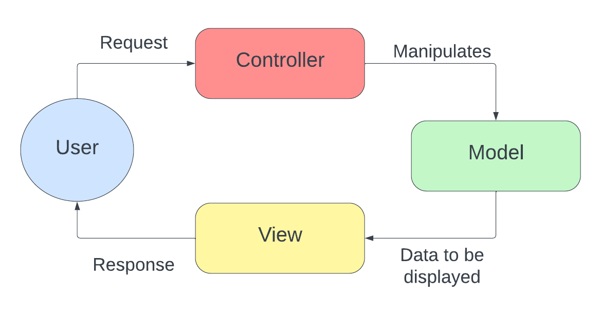

# Spring Certified Professional 2023 - Study Guide

## Module 5 - Spring MVC and the Web Layer

***

### 1. MVC is an abbreviation for a design pattern. What does it stand for and what is the idea behind it?

MVC stands for Model View Controller. It is a design pattern which divides the application into three interconnected components.

| Model            | View                                                 | Controller                     |
|------------------|------------------------------------------------------|--------------------------------|
| Data Access  | Data representation to the user                      | Accepts requests from the user |
| Business Logic   | Multiple representation of the same data is possible | Issues commands to the model   |   
| Data Structures  |                                                      | Modifies the model             | 
| CRUD Logic       |                                                      | Decides on view to use         | 

**Advantages of MVC design pattern?**

- Separation of concerns
- Increases code cohesion 
- Increases code re-usability
- Reduces coupling between data, login, and information representation
- Lowers maintenance costs 
- Increase extendability 

